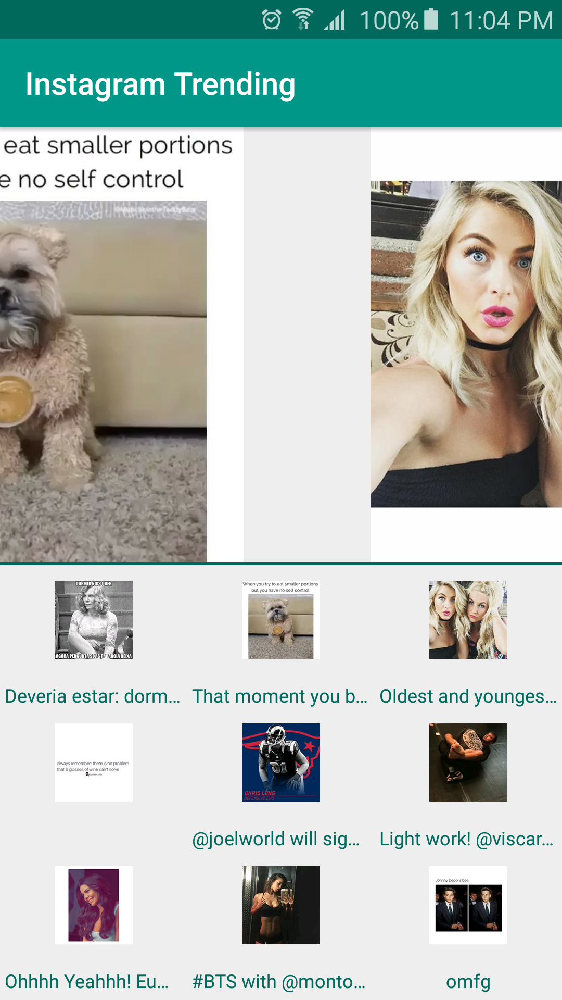
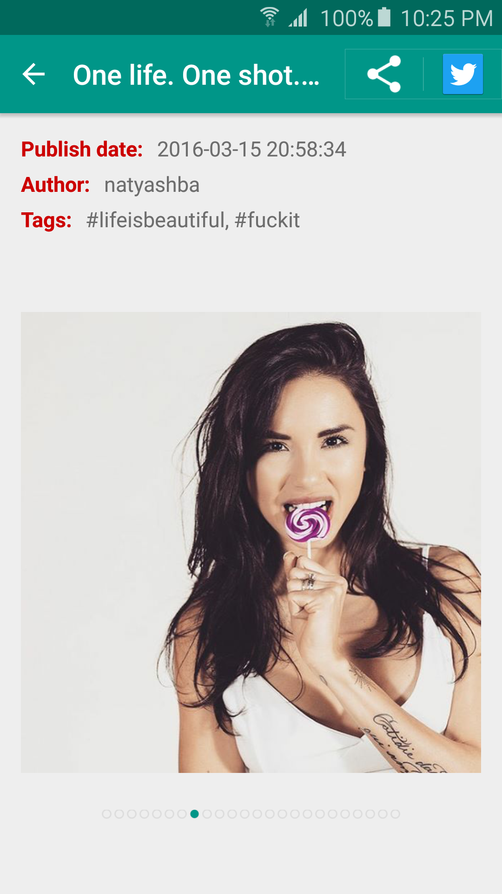
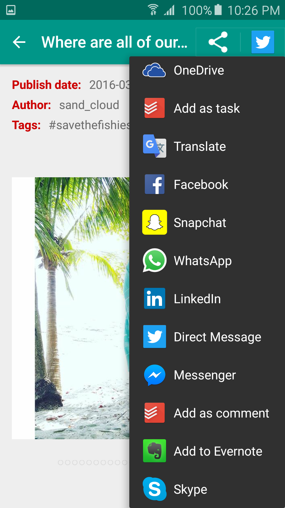
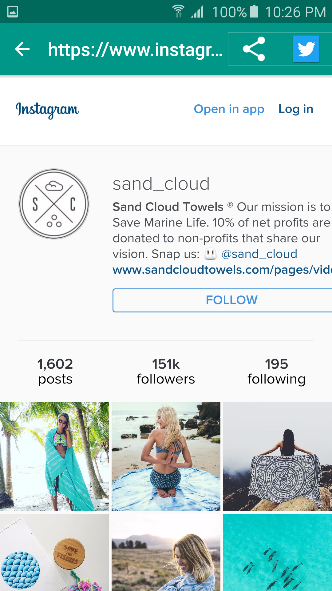
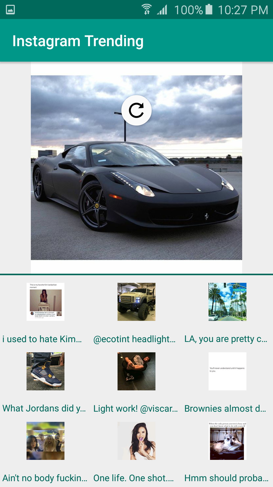
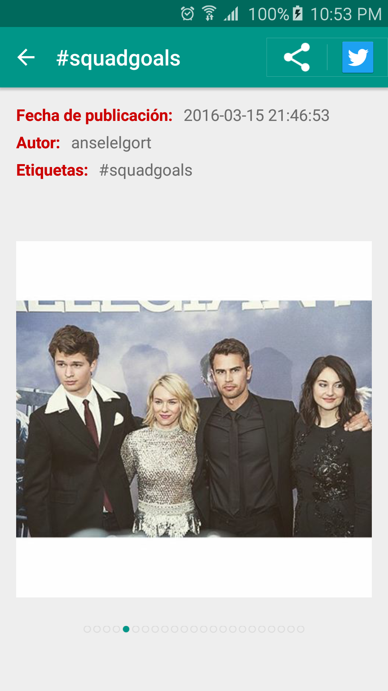

# Instagram Trending

An Android application that consumes an API from Instagram that shows the latest and most popular photos at the moment.

The URL of the API comes from: https://api.instagram.com/v1/media/popular?client_id=05132c49e9f148ec9b8282af33f88ac7

### How to use it

The main view of the app consist in one big picture and a grid view with all the images. Once in the app you decide if you want to use the swipe of the big picture to navigate through them or watch them all from the grid view. You can select a picture that is in the grid view to watch it on the big picture zone.

Click on a big picture and you'll see more details about the image. Swipe right or left here to continue looking the photos and reading about them.
If you really like a photo you can easily share it with your friends.

To know more about the author of the picture click on the image and you'll be redirect to the Instagram page of the author.

### Special features

The app has pull to refresh so you can update the pictures on a cooler way!

Instagram Trending also supports two different languages, English and Spanish, awesome!.

